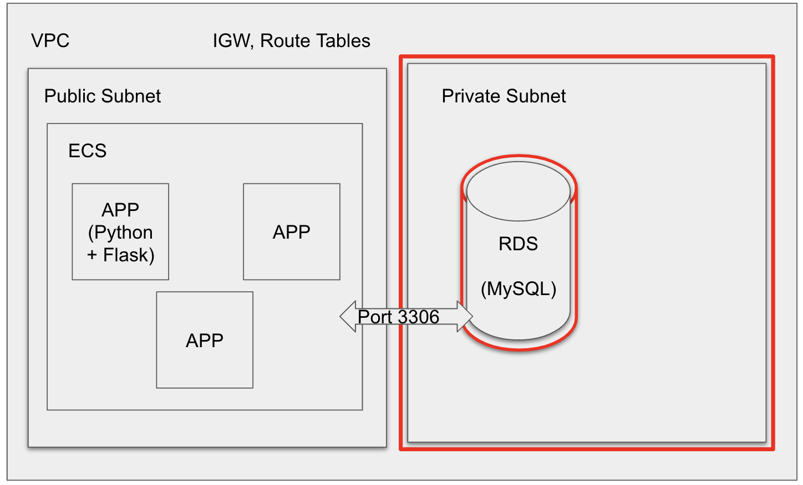

# App Requirements
This is a simple app which connects to an existing RDS instance. To run this app, you must first export the following credentials: 
```bash
export MYSQL_HOST=<your-rds-endpoint>
export MYSQL_USER=<your-rds-master-user>
export MYSQL_PASSWORD=<your-rds-password>
```
and install the requirements by running `pip install -r requirements.txt`. 

If you run into errors with Flask-MySQLdb due to `mysqlclient` dependency, this can be resolved by first installing `mysql` using brew, if on mac, then `pip install mysqlclient` and finally `pip install flask_mysqldb`. For more OSs please refer to [this guide](https://pypi.org/project/mysqlclient/). 

Please refer to the README file in the `app` directory for more details on what the app does, how it was tested locally, and the notes / initial plan regarding deployment. 

# Terraform 
Run the following to set your AWS credentials for the account you would like to build in:
```bash
export AWS_ACCESS_KEY_ID=<your-access-key>
export AWS_SECRET_ACCESS_KEY=<your-secret-key>
export AWS_DEFAULT_REGION=<your-desired-region>
```
### 1. Building the wider infrastructure
The plan is to have wider infrastructure which looks like this, first I will build the VPC, two subnets and configure firewalls. 


### 2. Building the DB 
To avoid having credentials in plaintext, create your DB credentials by running the following commands before TF apply:
```bash
export TF_VAR_db_username=<your-master-username>
export TF_VAR_db_password=<your-password>
```
These will be exported by the module as outputs, but not shown in plaintext, so they can be transferred to the app instances to access the DB:
```terraform
output db_host {
    value = aws_db_instance.mood_db.address
}

output db_username {
    value = sensitive(aws_db_instance.mood_db.username)
}

output db_password {
    value = sensitive(aws_db_instance.mood_db.password)
}
```