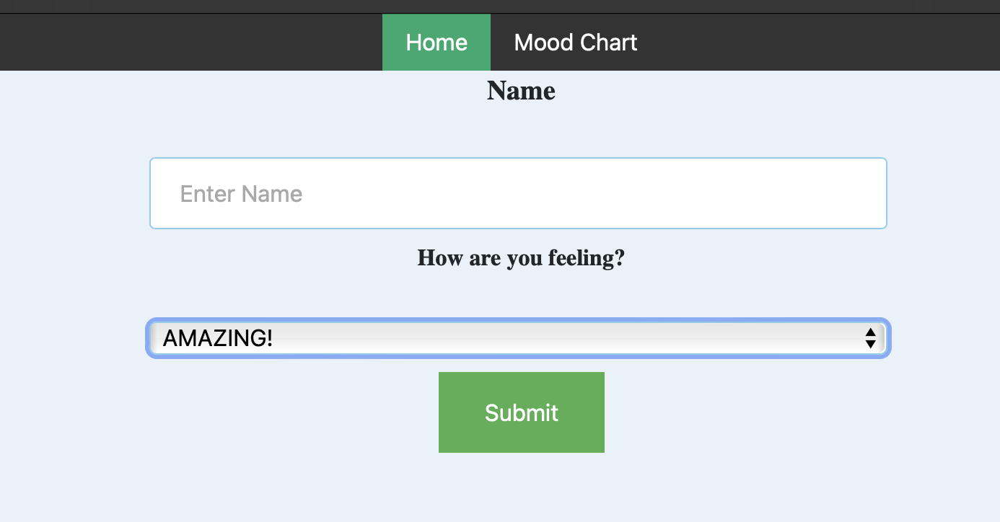
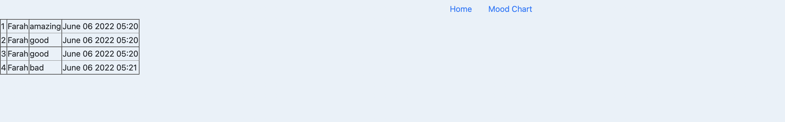
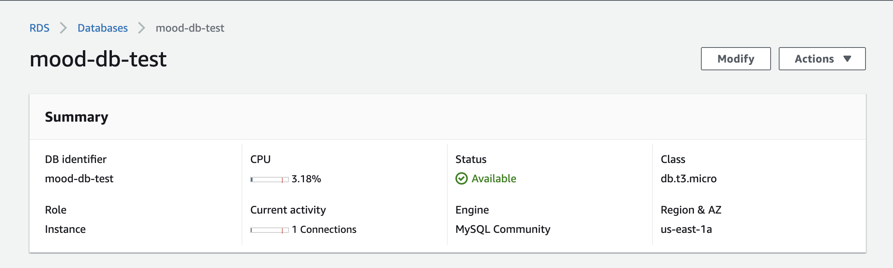

# Mood Tracker App (1st Iteration)

The user is first greeted with this page where they can fill out and submit this form:

After they submit an entry they are treated with a success page and promted to head to the `Mood Chart` tab where they can see all past submisisons, which are stored in the RDS. 


This was tested first locally to understand what provisioning was needed for both the app and DB, using a publicly available RDS instance created using AWS console:


Obviously this app is quite simple, but it is enough to demonstrate that there is a web interface, it is connecting to and successfully querying a relational database.

### Lessons from Local Testing: 
- DB instance must be created first
- APP needs to 'know' DB credentials
    - I would prefer to use a bastion to provision both, for the purposes of this task I will use the app to provision the DB because it will need and have the credentials anyways. 
    - can use `depends_on` and terraform provisioner using the output of rds module in the init of the app. 
- Database `users` must be provisioned as follows: 
    ```sql
    CREATE DATABASE users;
    USE users;
    CREATE TABLE users(
        -> userid int NOT NULL AUTO_INCREMENT,
        -> name  varchar(255) NOT NULL,
        -> mood  varchar(255) NOT NULL,
        -> date  varchar(255) NOT NULL,
        -> PRIMARY KEY (userid));
        ```